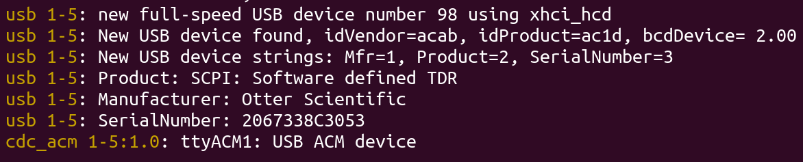
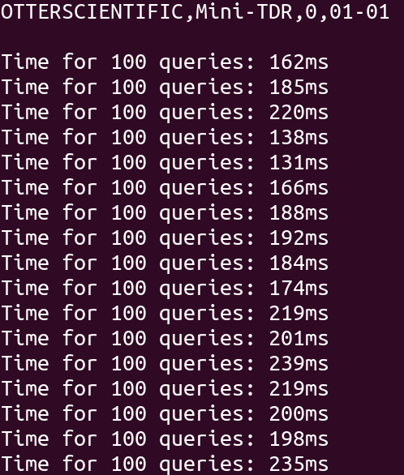

# stm32g4xx_usb_cdc

This repo contains a STM32G474 USB CDC example implementation, combined with [Jan Breuer's SCPI parser library v2](https://www.jaybee.cz/scpi-parser/) allowing you to build your own STM32G4xx based scientific instruments.

The STM will present a Serial device, running the SCPI parser.



A query speed test can be performed by running `testscripts/speedtest.py`, performances up to 70ms/100 requests have been seen.




### Working example instruments

[NiklasFauth's Wireless Charging SMU](https://github.com/NiklasFauth/charge-hf)


[Jan--Henrik's Mini-TDR](https://github.com/Jan--Henrik/Mini-TDR)


### Folder structure

- **usb_cdc_g4/** : Universal CDC implementation for STM32G4xx, include this folder + changes to the Makefile
- **libscpi/** : [Jan Breuer's awesome SCPI parser library v2](https://www.jaybee.cz/scpi-parser/)
- **Inc/** : Contains the header files, please note `Inc/scpi-def.h`
- **Src/** : Contains the source files, please note `Src/scpi-def.c` and `Src/scpi-com.c`
- **testscripts/** : Contains some python test scripts and example software


### How to use the CDC-library for your own project

- Copy `usb_cdc_g4/` and its contents to your project folder.

- Add the following lines to your Makefile.

```
C_SOURCES += \
usb_cdc_g4/STM32_USB_Device_Library/Class/CDC/Src/usbd_cdc.c \
usb_cdc_g4/STM32_USB_Device_Library/Core/Src/usbd_core.c \
usb_cdc_g4/STM32_USB_Device_Library/Core/Src/usbd_ctlreq.c \
usb_cdc_g4/STM32_USB_Device_Library/Core/Src/usbd_ioreq.c \
Drivers/STM32G4xx_HAL_Driver/Src/stm32g4xx_hal_pcd.c \
Drivers/STM32G4xx_HAL_Driver/Src/stm32g4xx_hal_pcd_ex.c \
Drivers/STM32G4xx_HAL_Driver/Src/stm32g4xx_ll_usb.c \
usb_cdc_g4/Src/usbd_cdc_if.c \
usb_cdc_g4/Src/usb_device.c \
usb_cdc_g4/Src/usbd_conf.c \
usb_cdc_g4/Src/usbd_it.c \
usb_cdc_g4/Src/usbd_desc.c

C_INCLUDES +=  \
-Iusb_cdc_g4/STM32_USB_Device_Library/Class/CDC/Inc \
-Iusb_cdc_g4/STM32_USB_Device_Library/Core/Inc \
-Iusb_cdc_g4/Inc
```

- Add the following to your global variables if needed.

```
extern uint8_t UserRxBufferFS[APP_RX_DATA_SIZE];
extern uint8_t UserTxBufferFS[APP_TX_DATA_SIZE];
extern uint8_t is_new_data_ready;
extern uint16_t new_data_length;
```

- Call the USB init

```
MX_USB_PCD_Init();
MX_USB_Device_Init();
```

- Received Data is present within main.c though the earlier added global variables, e.g.:

```
if (is_new_data_ready) {
  SCPI_Input(&scpi_context, UserRxBufferFS, new_data_length);
  is_new_data_ready = 0;
}
```

- Data can be transmitted via:

```
CDC_Transmit_FS(data, length);
```
